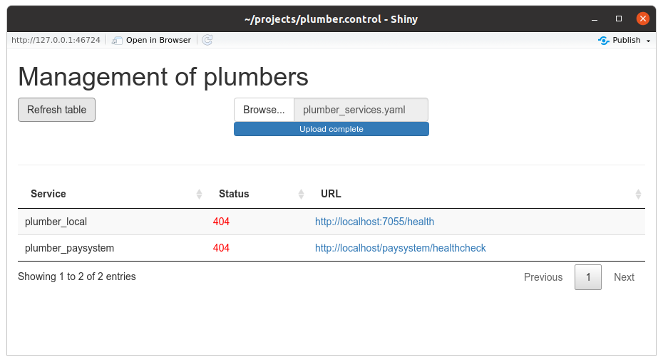

<!-- README.md is generated from README.Rmd. Please edit that file -->

```{r, include = FALSE}
knitr::opts_chunk$set(
  collapse = TRUE,
  comment = "#>",
  fig.path = "man/figures/README-",
  out.width = "100%"
)
```

# plumber.control

<!-- badges: start -->
[](https://github.com/vanhry/plumber.control/actions)
<!-- badges: end -->

The goal of plumber.control is to control all of your R plumber (actually any http based) services in one place.

## Installation

Development version

``` R
remotes::install_github("vanhry/plumber.control")
```

``` {r}
library(plumber.control)
```

If you want to use this library you must create `yaml` file of your plumber services

``` yaml
`r xfun::file_string(system.file("plumber_services.yaml",package="plumber.control"))`
```

Add to your `plumber.R` file **/healthcheck** method
```r
#' @get /healthcheck
function(res) {
  res$status <- 200
  res$body <- "Healthy"
  res
}
```

You can use `create_table_plumber("path/to/file")` to receive the table of all services

```{r}
data <- create_table_plumber(system.file("plumber_services.yaml",package="plumber.control"))
data
```

Also it's possible to use shiny application with:
```r
plumber.control::run_app()
```


Build Docker
```shell
docker build . -t user/plumbercontrol_app -f Dockerfile.min
```

Project was created using [golem](https://github.com/ThinkR-open/golem) package
