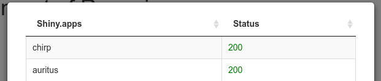

<!-- README.md is generated from README.Rmd. Please edit that file -->

## plumber.control

<!-- badges: start -->

[](https://github.com/vanhry/plumber.control/actions)
<!-- badges: end -->

The goal of plumber.control is to control all of your R plumber
(actually any http based) services in one place.

# Shiny app

#### Deployment of shiny app

Lightweight version of shiny application based on [R-minimal Docker
image](https://github.com/r-hub/r-minimal) with simple and secure [Caddy
server](https://github.com/caddyserver/caddy)

You just need to clone the repo, build the docker, install system
variables `$HOST` and `$EMAIL`, and run: `docker-compose up -d`

And that’s it\! 🏆

# Package

#### Installation of package

Development version

``` r
remotes::install_github("vanhry/plumber.control")
```

``` r
library(plumber.control)
```

If you want to use this library you must create `yaml` file of your
plumber services

``` yaml
# http://localhost:7055/health
plumber_local:
  host: localhost
  port: 7055
  path:
  method_plumber: health
  scheme: http
  is_shiny_app: false

# http://localhost/paysystem/healthcheck
plumber_paysystem:
  host: localhost
  port:
  path: paysystem
  method_plumber: healthcheck
  scheme: http
  is_shiny_app: false

shinyserver:
  host: shiny.john-coene.com
  port:
  path:
  method_plumber: ""
  scheme: https
  is_shiny_app: true

one_app_shinyserver:
  host: vanhryshinyserver.xyz
  port:
  path:
  method_plumber: ""
  scheme: https
  is_shiny_app: true
```

Add to your `plumber.R` file **/healthcheck** method

``` r
#' @get /healthcheck
function(res) {
  res$status <- 200
  res$body <- "Healthy"
  res
}
```

You can use `create_table_plumber("path/to/file")` to receive the table
of all
services

``` r
data <- create_table_plumber(system.file("plumber_services.yaml",package="plumber.control"))
data
#>                Service Status                                    URL result is_shiny_app
#> 2        plumber_local    404           http://localhost:7055/health  FALSE        FALSE
#> 21   plumber_paysystem    404 http://localhost/paysystem/healthcheck  FALSE        FALSE
#> 3          shinyserver    200          https://shiny.john-coene.com/   TRUE         TRUE
#> 4  one_app_shinyserver    200         https://vanhryshinyserver.xyz/   TRUE         TRUE
```

Also it’s possible to use shiny application with:

``` r
plumber.control::run_app()
```


If click on Details for shiny server, it will open the modal with each
service



Build Docker

``` shell
docker build . -t user/plumbercontrol_app -f Dockerfile
```

Project was created using [golem](https://github.com/ThinkR-open/golem)
package
